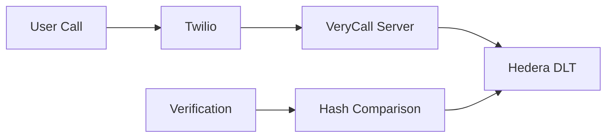

# VeryCall - Secure Call Verification with Hedera

---
> ### 🧪 Quick Test Instructions for the Hedera Hackathon 2.0 Judges
> 
> 1. **Make a Call**
>    - 📞 Call: `+12345622404` (normal US landline)
>    - 📝 Note the verification code from voice/SMS 
>    - ⚠️ Due to A2P 10DLC regulatory requirements, US numbers will not receive an SMS
> 
> 2. **View on Hashscan**
>    - 🔍 Topic ID: `0.0.5273088`
>    - 🌐 [View Topic on Hashscan](https://hashscan.io/testnet/topic/0.0.5282308)
> 
> 3. **Verify Your Call**
>    - 🔗 Visit: [Verification Portal](https://plankton-app-q7ra7.ondigitalocean.app/verify)
>    - ✅ Enter your code (and optionally your phone number for confirmed verification)
---

VeryCall is a secure call logging and verification system built on Hedera's distributed ledger technology. It provides transparent, verifiable proof of calls while maintaining privacy through hashing.

## Features
- 🔐 Secure call logging on Hedera
- 📱 SMS & Voice verification codes
- 🔍 Call verification portal
- 🔒 Privacy-preserving through hashing
- ✅ Optional phone number verification

## How It Works

1. **Call Logging**
   - User calls the Twilio number
   - System generates a unique verification code
   - Code is delivered via voice and SMS
   - Call details are hashed and stored on Hedera

2. **Verification**
   - User visits verification portal
   - Enters verification code
   - Optionally provides phone number
   - System verifies against Hedera records
   - Provides proof link to Hashscan

## Prerequisites

- Node.js (v16+)
- Twilio Account
- Hedera Testnet Account
- DigitalOcean Account (for deployment)

## Environment Setup

Create a `.env` file with:

```
Twilio Configuration
TWILIO_ACCOUNT_SID=your_account_sid
TWILIO_AUTH_TOKEN=your_auth_token
TWILIO_PHONE_NUMBER=your_twilio_number

Hedera Configuration
HEDERA_ACCOUNT_ID=your_account_id
HEDERA_PRIVATE_KEY=your_private_key
HEDERA_TOPIC_ID=your_topic_id
HEDERA_NETWORK=testnet

Application Configuration
PORT=3000
BASE_URL=your_application_url
```
## Installation
```
git clone https://github.com/remoch/verycall.git
cd hedera
```

Install dependencies
`npm install`

## Local Development

1. Start server `node src/index.js`

2. Start ngrok for Twilio webhook: `ngrok http 3000`

3. Update Twilio webhook with ngrok url + `/voice`

## Deployment

### DigitalOcean App Platform
1. Fork this repository
2. Create new app in DigitalOcean
3. Connect to your GitHub repository
4. Add environment variables
5. Deploy!

## Testing

### Test Call Flow
1. Call your Twilio number
2. Note the verification code from voice/SMS
3. Visit `/verify` on your deployment
4. Enter code to verify call

### Important Notes

#### Phone Number Restrictions
- **US Numbers**: Requires A2P 10DLC registration for SMS - https://www.twilio.com/docs/sms/a2p-10dlc
- **International**: Check Twilio geographic permissions
- **Test Numbers**: Available in Twilio console

#### Privacy Considerations
- Phone numbers are hashed before storage
- Verification codes are hashed
- No plain text sensitive data on Hedera
- Optional phone number verification

## Architecture

### Components
- **Twilio Service**: Handles incoming calls and SMS
- **Hedera Service**: Manages DLT interactions
- **Verification Portal**: Web interface for verification

### Data Flow



## Use Cases

1. **Call Centers**
   - Verify customer interactions
   - Maintain call records
   - Privacy-compliant logging

2. **Legal Requirements**
   - Proof of communication
   - Timestamp verification
   - Immutable records

3. **Customer Service**
   - Verify support calls
   - Track interactions
   - Transparent logging

## Security

- All sensitive data is hashed using SHA-256
- No plain text phone numbers stored
- Optional two-factor verification (code + phone)

## Troubleshooting

### Common Issues

1. **SMS Not Received**
   - Check Twilio geographic permissions
   - Verify international SMS capability
   - Check number format (+[country][number])

2. **Verification Fails**
   - Confirm correct code entry
   - Check phone number format

3. **Deployment Issues**
   - Verify environment variables
   - Check build logs
   - Confirm webhook URLs
